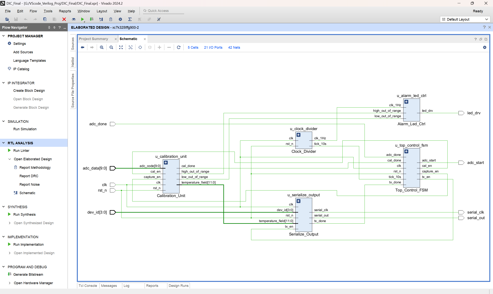
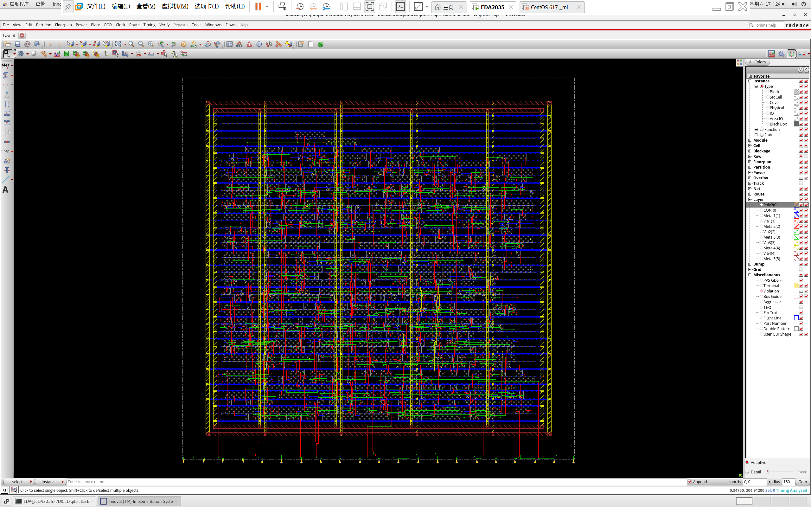

# Zhenhuan Shao
### Engineering Portfolio

**Digital IC Design · Computer Architecture · AI Hardware**

[CCIC Processor](#01--risc-v-processor-design) · [DIC Sensor Interface](#02--digital-sensor-interface) · [Photonics Research](#03--photonic-filter-research) · [GitHub](https://github.com/LaoPenguin)

---

I am an undergraduate in Microelectronic Science and Engineering in the joint programme between the **University of Electronic Science and Technology of China** and the **University of Glasgow**. My primary interests are digital integrated circuits, processor architecture, and AI hardware.

The projects below follow my work from **processor RTL and execution control** to **digital physical implementation**, complemented by research experience in photonic modelling and experimental data analysis.

## 01 · RISC-V Processor Design

**CCIC · Two-person team · 2026**

`SystemVerilog` · `Vivado / XSim` · `RV32I / RV32IM`

A four-stage processor developed for the CCIC competition, followed by an RV32M extension. The team received the **Southwest China Regional Third Prize**.

*Competition RV32I architecture. I designed IF–ID–EX and the register pending table; my teammate primarily implemented LSU and WB.*

- **My work:** pipeline control, dependency tracking, and stall/ready propagation; later multiplication/division RTL, execution integration, and CSR-related logic.
- **Design detail:** the later divider processes four bits per iteration using a radix-16 structure, completing arithmetic in eight iterations.
- **Evidence:** competition bitstream demonstration on the organiser's platform; later whole-core RV32M program simulation in XSim. The two stages are documented separately.

**[Explore the project →](projects/CCIC_Risc%20V_CPU/README.md)** · [Competition demonstration video](projects/CCIC_Risc%20V_CPU/videos/rv32i-coe0-demo.mp4)

---

## 02 · Digital Sensor Interface

**Design of Integrated Circuits · Coursework · 2026**

`VHDL / Verilog` · `Fixed-point Arithmetic` · `Cadence Innovus`

A digital subsystem for a PT100 temperature interface, combining calibration, conversion control, out-of-range indication, and serial output.

*Digital architecture: five functional blocks coordinate ADC conversion, temperature processing, and output.*

*Digital_Top physical implementation in Innovus. This is the digital block, not an integrated layout of the complete mixed-signal system.*

- **My work:** digital RTL, testbenches, Q12 calibration, physical implementation, and the ADC–digital interface specification. The ADC group implemented the proposed interface on its side.
- **Analysis:** approximately **0.0521 °C** maximum digital conversion error relative to the ideal linear mapping, established by mathematical enumeration.
- **Implementation:** **533 standard cells**, approximately **13,312 μm²** standard-cell area, and zero setup/hold violating paths in the archived **1 MHz** post-route reports. Remaining fanout and signoff limitations are explained in the project page.

**[Explore the project →](projects/DIC_Sensor_Interface/README.md)** · [RTL source](projects/DIC_Sensor_Interface/src/) · [Testbenches](projects/DIC_Sensor_Interface/tests/vhdl/) · [Implementation reports](projects/DIC_Sensor_Interface/results/)

---

## 03 · Photonic Filter Research

**University of Glasgow · Summer research · July–August 2025**

`MATLAB` · `Transfer Matrix Method` · `Python`

Research training in sampled Bragg grating filters, combining reproduction of established models, parameter exploration, optical-path adjustment, and spectrum visualisation.

*Experimental spectrum reproduced from my research report. The device was an existing group sample; this figure is not direct quantitative validation of my simulated structure. Original axis labels are retained.*

- **My work:** modified supervisor-provided models to explore grating phase shifts and chirp; participated in optical-path connection and adjustment; processed experimental spectra with Python.
- **Research skills:** interpreting models, investigating unexpected outputs, exploring parameter effects, and communicating methods and limitations.
- **Public materials:** selected archived spectra and an auxiliary plotting example using explicitly synthetic data. Core research code and raw experimental data remain private.

**[Explore the research →](projects/EC-4PS-SBG_Photonic%20Filter/README.md)** · [Synthetic-data plotting example](projects/EC-4PS-SBG_Photonic%20Filter/demo/)

---

## Technical toolkit

| Area | Experience |
| --- | --- |
| Digital design | SystemVerilog, Verilog, VHDL; processor datapaths, control, and handshakes |
| Verification | Vivado/XSim, self-checking testbenches, whole-core program simulation |
| Physical implementation | Cadence Innovus; placement, routing, and interpretation of timing/physical checks |
| Research computing | MATLAB modelling; Python, pandas, Matplotlib, and Seaborn |

Each project page identifies my contribution, available evidence, and verification limits. Simulation results, mathematical analysis, and physical implementation results are reported separately.

[GitHub · LaoPenguin](https://github.com/LaoPenguin)

