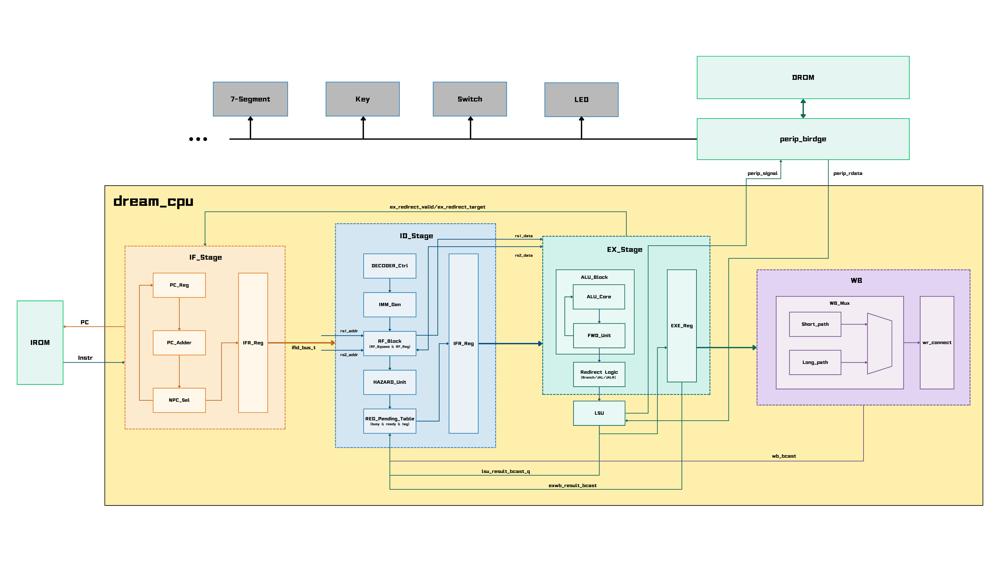

# RISC-V Processor Design — CCIC

**Context:** two-person competition team, 2026  
**Award:** Southwest China Regional Third Prize  
**Tools:** SystemVerilog, Vivado, XSim

## Overview

We developed a four-stage RISC-V processor with instruction fetch, decode, execution/load-store, and writeback stages. The competition submission implemented RV32I. A subsequent extension around mid-July 2026 added multiplication/division support and CSR-related adaptations.

## My contribution

- Designed and implemented the IF, ID, and EX stages.
- Implemented a register pending table as a simplified scoreboard. Its intended role was to track operand readiness and coordinate dependent instruction issue with result broadcasts.
- Revised stall/ready propagation and retained valid state and instruction data independently in each stage to address long control paths into IF.
- For the later RV32M extension, implemented multiplication/division decode, arithmetic units, execution-path integration, backpressure control, and CSR-related logic.

My teammate primarily implemented LSU and WB, including subsequent data-bus FIFO work and the unified WB flush sequence. We discussed system-level design decisions together.

## Competition architecture

The competition architecture already includes the register pending table. My main implementation responsibility was IF–ID–EX; LSU and WB were primarily my teammate's responsibility. This figure is the original project diagram, rather than an independently verified netlist schematic.

## Design decisions

### Control-path timing

High fan-in and fan-out around IF made routing delay a concern. I adjusted stall/ready propagation and gave each stage local valid/data storage. The revised design was exercised through whole-core programs; dedicated backpressure corner-case testing was not performed. No before/after timing improvement is claimed.

### Later arithmetic extension

The currently retained RTL uses a registered multiplication datapath described with the `*` operator, with signed/unsigned operand extension and high/low result selection. It does not directly instantiate a ready-made multiplier IP.

The divider uses radix-16 iteration: four bits per iteration and eight iterations for a 32-bit operation. Divisor multiples are precomputed and registered. Both units retain results under WB backpressure and support cancellation. These structures reflect a trade-off between arithmetic latency and timing; no comparative radix benchmark is claimed.

## Validation and results

| Stage | Validation | Scope |
| --- | --- | --- |
| Competition RV32I | Bitstreams tested through the organiser-provided board platform; coe0/coe1/coe2 demonstration recordings retained | Typically operated at 125 MHz; some limiting cases required 120 MHz, according to my project records and recollection. The platform's backend hardware has not been independently identified here. |
| Subsequent RV32IM extension | Whole-core programs containing multiply/divide instructions run in Vivado/XSim; CSR adaptations completed | Functional RTL simulation, not a claim of full ISA compliance or physical-board testing. |
| Subsequent physical implementation | Reported post-route timing pass at 150 MHz | The corresponding implementation report and source revision are still being matched before this metric is used as a verified headline result. |

The preliminary report's reference to a 100 MHz fallback was identified by me as inaccurate; the recalled operating frequency is 120 MHz. The associated recording still needs to be checked before presenting this as a video-verified result.

## Materials

- Architecture diagram: included above.
- [Competition RV32I coe0 demonstration video](videos/rv32i-coe0-demo.mp4) — original supplied recording, approximately 73 MiB. This supports the competition-stage demonstration only; it is not evidence of the later RV32IM extension or 150 MHz timing result. The full recording has not yet been independently reviewed for this portfolio.
- Source code and raw timing/resource reports: not distributed in this portfolio.

The competition architecture and later extension are presented separately so that the original demonstrations are not mistaken for evidence of the later RV32IM implementation.
