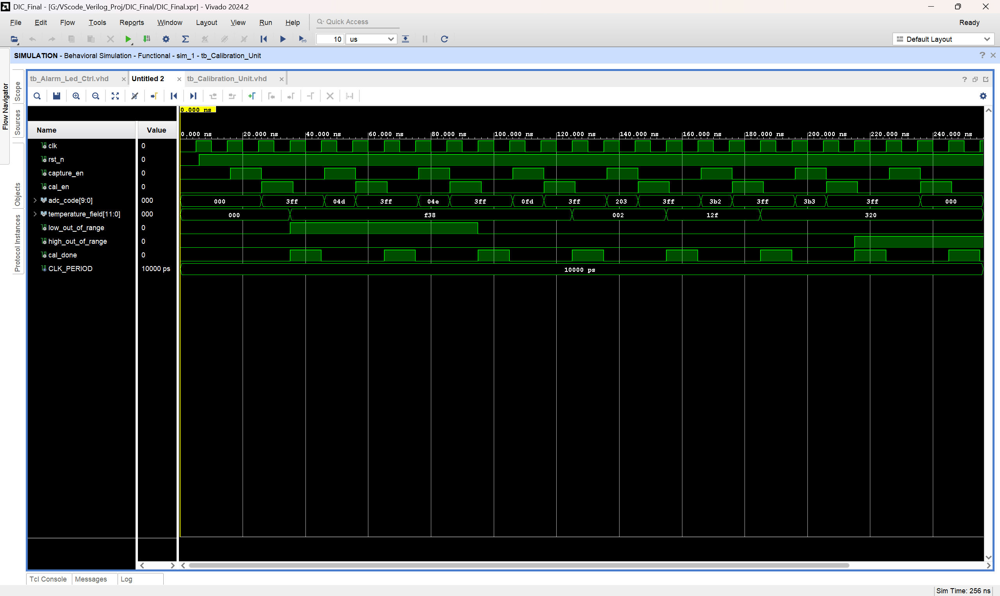
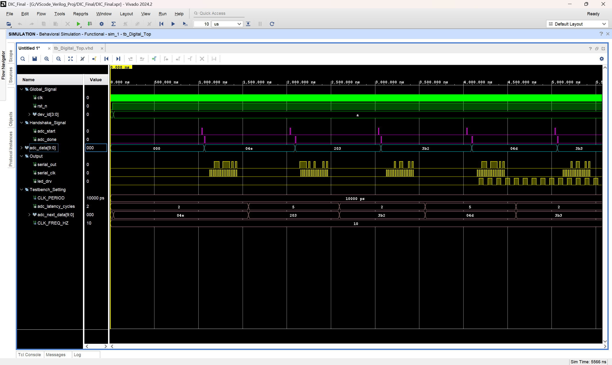

# Digital Calibration and Control for a PT100 Sensor Interface

**Context:** Design of Integrated Circuits coursework, 2026  
**Team:** six students across analogue, ADC, and digital subgroups  
**Tools:** VHDL, Verilog, Vivado, Cadence Innovus

## Overview

The course specified a PT100 temperature interface spanning −20 to +80 °C, a 10-second update interval, an out-of-range LED, and a 16-bit LSB-first serial output containing temperature and device identification fields. It supplied a linear calibration form; the fixed-point implementation was developed within the project.

## Digital architecture

[](assets/digital-top-rtl.png)

*Figure 1. Vivado elaborated RTL view of the digital subsystem: calibration, clock divider, control FSM, alarm control, and serial output. The ADC connects through start/done/data signals. This is an RTL connectivity view, not a full mixed-signal chip schematic. Click any figure to view the original image.*

## My contribution

I implemented the digital subsystem, including calibration arithmetic, control FSM, serial output, alarm control, testbenches, and digital physical implementation. I also reviewed the overall report. My digital-subgroup partner contributed to report writing.

I proposed the ADC–digital interface scheme, including conversion-start control, completion synchronisation, result capture, and the distinction between internal busy/load signals and external interfaces. The ADC subgroup implemented that scheme. I do not claim authorship of the ADC core.

## Design decisions

- Used Q12 fixed-point coefficients for linear ADC-to-temperature conversion after theoretical consideration of precision and hardware cost. Different word lengths were not compared through separate synthesis runs.
- Clamped inputs outside the calibrated range and produced explicit out-of-range flags.
- Used a digital-controlled conversion request and a completion/data interface to coordinate the ADC and digital controller.
- Developed the coursework RTL in VHDL, then converted it to Verilog for backend implementation. I compared both versions using the same testbenches; this was simulation-based comparison, not formal equivalence checking.

## Calibration analysis

For ADC code `c`, the retained RTL implements:

```text
c_clamped = clamp(c, 78, 946)
temperature_x10 = -200 + (((c_clamped - 78) * 4719 + 2048) >> 12)
temperature_C = temperature_x10 / 10
```

Mathematical enumeration of the 869 valid codes from 78 through 946 gives a maximum absolute deviation of approximately **0.052074 °C** from the ideal linear mapping. At code 936, the ideal value is approximately 78.847926 °C and the fixed-point output is 78.9 °C.

This is digital conversion error relative to an ideal mapping, not measured sensor accuracy. The retained calibration testbench contains eight representative input cases, including boundaries and saturation; it does not constitute an exhaustive 1024-code RTL simulation.

[](assets/calibration-simulation.png)

*Figure 2. Archived calibration-unit simulation showing input capture, fixed-point output, out-of-range flags, and completion pulses. Bus values are displayed in hexadecimal; the signed temperature field represents tenths of a degree Celsius. Inputs are deliberately changed after capture to exercise data retention. This illustrates selected test cases, not an exhaustive sweep.*

## Verification and implementation

ADC–digital subsystem simulation was completed during the project. The entire system, including power supply and instrumentation amplifier, was not integrated and verified as a complete chip.

[](assets/digital-top-simulation.png)

*Figure 3. Archived digital top-level testbench waveform showing ADC start/done handshakes, input codes, serial output bursts, and alarm activity. The ADC response is modelled by the testbench, with varying response latency; this screenshot is not evidence of transistor-level ADC co-simulation. Simulation timing is accelerated and does not represent the physical 10-second update interval.*

[](assets/digital-layout.png)

*Figure 4. Innovus physical-layout overview of Digital_Top, showing the digital block and routing/power structures. It excludes the analogue front end and ADC. This layout image does not establish full-chip integration or signoff; the checks and remaining limits are listed below.*

Existing Digital_Top backend reports record:

| Item | Recorded result |
| --- | --- |
| System-clock constraint | 1 MHz / 1000 ns |
| Post-route setup WNS | +871.255 ns; zero violating timing paths |
| Post-route hold WNS | +1.194 ns; zero violating timing paths |
| Standard-cell area | 13,311.693 μm² |
| Standard-cell instances | 533 |
| Innovus geometry, connectivity, and antenna checks | Zero reported violations |
| Output artifacts | GDS, DEF, routed netlist, and SDC retained locally |

**Limits:** the setup summary still reports max-fanout violations. No dedicated CTS step was performed, and no clock-tree skew/insertion-delay signoff is claimed. The reviewed archive contains no LVS or full foundry-signoff DRC report. Tool-level geometry checks do not substitute for those checks. These are existing project records; the backend flow has not been rerun for this portfolio.

## Source and evidence

- [VHDL RTL](src/vhdl/rtl/) and [constants package](src/vhdl/pkg/).
- [VHDL testbenches](tests/vhdl/).
- [Verilog RTL](src/verilog/).
- [Selected backend reports](results/).

For VHDL simulation, compile the constants package first, then the RTL and the selected testbench; the tests use VHDL-2008 `std.env.finish`. Testbench clocks and accelerated timing parameters are simulation settings, not physical timing constraints. Original Vivado caches, process libraries, course handouts, and full team reports are not included.
