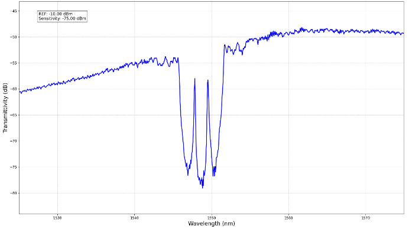
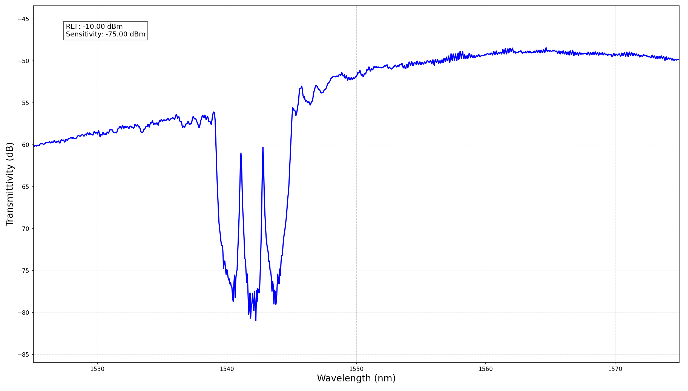

# Widely Tunable Photonic Filters for Next-Generation Optical Communication

**Context:** University of Glasgow summer research, July–August 2025  
**Supervision:** Professor Lianping Hou and Dr Simeng Zhu  
**Methods:** MATLAB transfer-matrix modelling, optical-path adjustment, Python spectrum visualisation

## Research focus

This project introduced me to sampled Bragg grating photonic filters and the relationship between grating structure and spectral response. It primarily involved reproducing established models, with additional exploration of parameter and structural variants.

## My contribution

- Studied and modified supervisor-provided MATLAB modelling code, exploring grating structure, phase-shift placement, and chirp parameters.
- Observed passband-position changes when adjusting phase-shift placement; no quantitative tuning relationship is claimed here.
- Participated in connecting and adjusting the experimental optical path for existing research-group samples.
- Used Python to process and plot experimental spectra and prepared an English research report.

The experimental samples were pre-existing group devices, not devices fabricated from my simulation design. Experimental characterisation is therefore not presented as direct quantitative validation of my model. The work demonstrates model interpretation, debugging, experimental participation, and technical communication alongside my primary interest in digital IC design.

## Selected experimental spectra



*Figure 1. Spectrum reproduced from my summer research report, page 11, Figure 8. The device was an existing research-group sample. I participated in optical-path connection/adjustment and processed the experimental data for plotting.*



*Figure 2. Spectrum reproduced from the same report, page 11, Figure 9, for a second existing sample. These are archived report figures, not newly reproduced plots. The original axis labels are retained; without the raw data and reference measurement, the vertical values should not be interpreted as independently verified insertion loss.*

These figures illustrate experimental participation and spectrum visualisation. They are not direct quantitative validation of my simulated structure. Original experimental data are not distributed.

## Public demonstration

[Lab_Data.py](demo/Lab_Data.py) is an adapted standalone plotting example. It uses an explicitly synthetic dataset and is intended only to demonstrate the plotting workflow.

```shell
python -m pip install -r requirements.txt
python Lab_Data.py
```

Run these commands from the `demo` directory. The script saves `synthetic-spectrum.png` there.

The synthetic data and resulting figure are **not measurements, not a reproduction of the research results, and not evidence of device performance**.

## Disclosure scope

Core simulation code, raw experimental data, and the complete report are not distributed. Only the two selected report figures above are included. The original experimental data files and the exact correspondence between archived simulation scripts and report figures have not yet been located. No claim of reproducible research results is made by this public plotting demonstration.
